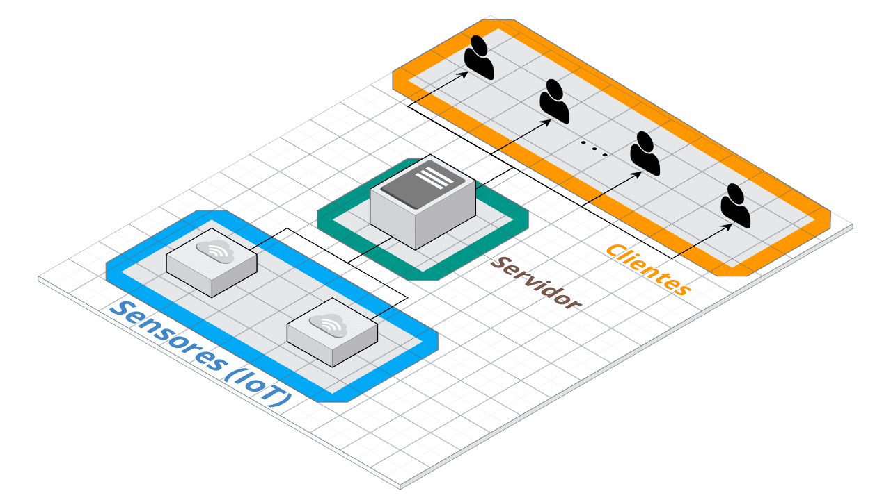
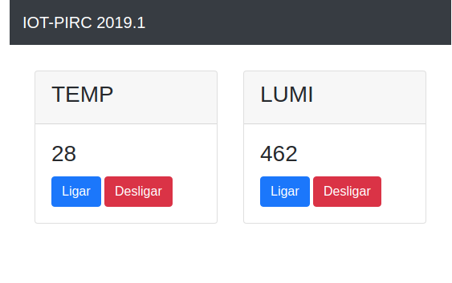

​	Trata-se de um projeto que busca integrar dispositivos IoT com clientes através de um servidor.

​	A arquitetura utilizará o protocolo de transporte TCP para viabilizar a comunicação entre sensores e um servidor, e desse servidor com clientes locais. O sensores emitirão informações sobre luminosidade e temperatura que serão repassados dinamicamentes aos clientes que terão acesso a esses dados através de uma página web.

​	O módulo dos sensores será escrito em C++ enquanto que o módulo do servidor e do cliente será escrito em Python. Servidor e cliente se comunicarão através da aplicação web *Flask* que utiliza o protocolo de aplicação HTTP.	

​	Segue abaixo uma esquematização do projeto proposto: 

## O Protocolo de comunicação

Para a comunicação entre os dispositivos IoT, o servidor e o clientes foi necessário desenvolver um protocolo de mensagens trocadas através de uma conexão _socket_ tcp. A descrição das mensagens é descrita abaixo.

### O _handshake_ IoT

Quando um dispositivo IoT se conecta ao servidor ele precisa informa ao servidor qual a sua identificação e quantos sensores ele possui, esse passo foi denominado de _handshake_ é foi implementado na ordem descrita abaixo:

MENSAGEM | DESCRIÇÃO  
---------|-----------
IAM [nome-identificador]| Enviado do IoT para servidor com o seu identificador.
+OK | Resposta do servidor indicando a disponibilidade do identificador.
SNS [valor-inteiro] | Enviado pelo IoT indicando quantos sensores ele possui.
+OK | Resposta de confirmação do servidor.

### O fluxo de dados medidos

Após o _handshake_ o dispositivo IoT passa a enviar os dados da sua medição utilizando a mensagem abaixo.

MENSAGEM | DESCRIÇÃO
--------|-----------
MEAS [valor-medido] | Mensagem enviada para o servidor contendo o valor medido pelo dispositivo

### O acesso aos dados medidos pelo cliente (CLI)

O cliente é capaz de acessar os dados que o servidor possui através das mensagens descritas abaixo:

MENSAGEM | DESCRIÇÃO
---------|----------
DEVLST | Requisita ao servidor a lista de dispositivos atualmente conectados.
+ID [identificador-iot] | Resposta do servidor ao comando DEVLST. Caso mais de um disposito estejam conectados as respostas são concatenadas em uma única mensagem.
GETMEAS [identificador-iot] | Requisita ao servidor o último valor medido pelo [identificador-iot].
+DATA [valor-medido] | Resposta a requisão feita pelo comando GETMEAS.

### Manipulação do dispositivo IoT pelo cliente

Nos protótipos desenvolvidos neste projeto, cada dispositivo IoT possui um _led_ que pode ser manipulado pelo cliente de acordo com o fluxo de mensagens abaixo.

MENSAGEM | DESCRIÇÃO
---------|----------
TURN [identificador-iot][0-1] | Faz o pedido ao servidor para mudar o estado do _led_ do dispositivo [0-OFF, 1-ON].
+OK | Resposta do servidor indicando a aceitação da requisição.
+LED [0-1] | Mensagem enviada do servidor para o dispositivo IoT com o estado do _led_.

### Mensagem de Erro

Para os casos de mensagens inválidas ou algum tipo de falha de comunicação o servidor retorna sempre a mensagem **+ERROR**

## O WEB Server

O servidor foi desenvolvido de forma a permiter além do acesso CLI um acesso WEB das funcionalidades do servidor. A figura abaixo mostra uma tela do protótipo.

